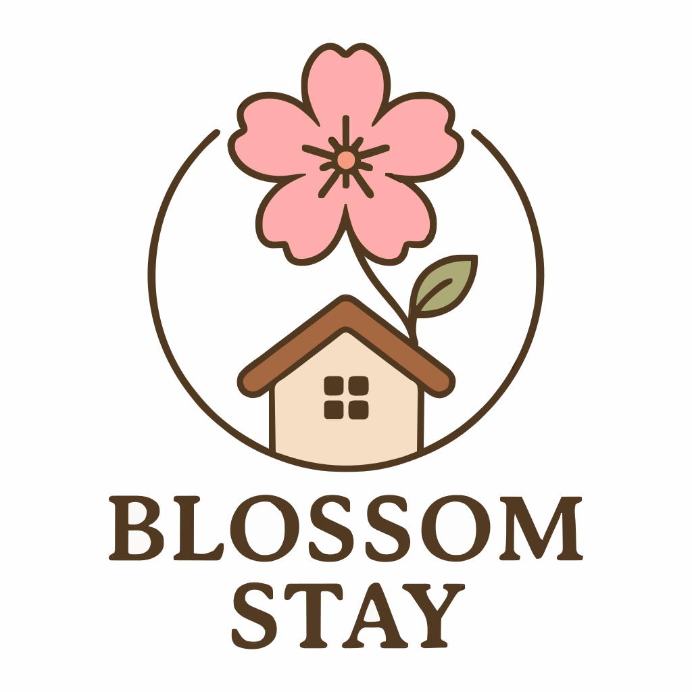

# 🌸 Blossom Stays – Airbnb-Inspired Stay Booking Website




> A modern, responsive, and aesthetic Airbnb clone made with **HTML, CSS, and JavaScript**, designed for cozy, aesthetic, and dreamy getaway bookings.  
> Built from scratch with clean UI, hover animations, and fully responsive layouts for mobile and desktop.

---

## 🚀 Features

- **Responsive Design** – Works seamlessly on desktop, tablet, and mobile.
- **Beautiful UI** – Soft pastel theme with modern layouts.
- **Interactive Cards** – Hover effects with tilt animations.
- **Search Bar** – Quickly find stays by name or location.
- **Filter Pills** – Category filters like *Girls’ Retreat*, *Aesthetic Homes*, *Cozy*, *Night Mode*.
- **Featured Stays** – Showcasing curated properties.
- **Lightweight** – No heavy frameworks, purely HTML, CSS, and vanilla JS.

---

## 🖼 Preview

---

## 🛠 Technologies Used

- **HTML5** – Structure of the site
- **CSS3** – Styling with modern layouts (Flexbox, Grid)
- **JavaScript (Vanilla)** – Interactive elements and animations
- **Google Fonts** – Poppins font family
- **Git & GitHub** – Version control and hosting

---

## 💡 How to Run Locally

1. Clone this repository:
   ```bash
   git clone https://github.com/YOUR-USERNAME/blossom-stays.git


---

<details>
<summary>📂 Project Structure</summary>
blossom-stays/
├── assets/
│ ├── images/
│ │ ├── hero-banner.jpg
│ │ ├── stay1.jpg
│ │ ├── stay2.jpg
│ │ └── ...
├── css/
│ └── style.css
├── js/
│ └── main.js
├── index.html
└── README.md

